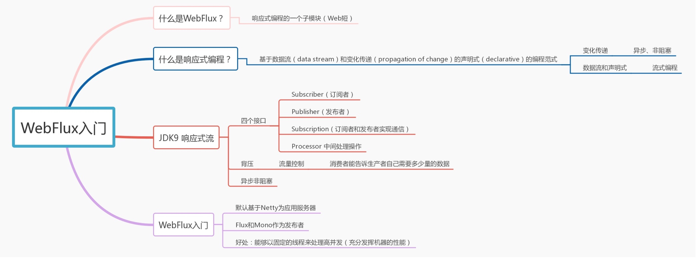

# SpringBoot WebFlux 2.0.3 版

分支

- master 第一版
- reactor 第二版

环境

- SpringBoot 2.0.3.RELEASE
- SpringBoot WebFlux
- SpringBoot Data Jpa
- Apache Shiro
- Reactor 
- Ehcache
- Redis
- Freemarker

功能

- Controllers 异步
- Services 异步
- Dao 依赖于JDBC和ORM，暂未更改成异步
- 移除Druid和多数据源

使用 

1. 启动MySQL
    - 默认账号 root root（或者修改application.properties）
    - 创建数据库 managesystemdb
2. 系统登录 admin 111111（默认每次启动都会重新创建表并覆盖写入初始化的数据）

PS: 第二版并没有修复bug，仅技术改进，代码整理